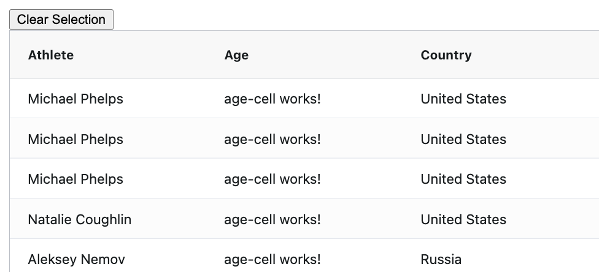
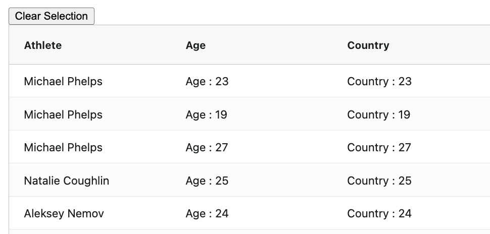

# JS Nation - AG Grid Angular Workshop

## Custom Cell Renderers

Use our own custom Angular components to display values in our cells. 

Generate the component with cli.

```bash
ng g c cell --inline-style --inline-template
```

Make sure to correctly implement the `ICellRendererAngularComp` interface.

```ts
import { Component } from '@angular/core';
import { ICellRendererAngularComp } from 'ag-grid-angular';
import { ICellRendererParams } from 'ag-grid-community';

@Component({
  selector: 'app-cell',
  template: `
      cell works!
  `
})
export class CellComponent implements ICellRendererAngularComp {

  agInit(params: ICellRendererParams): void {
  }
  refresh(params: ICellRendererParams): boolean {
    return false;
  }
}

```

To use the component in the age column add it to the column definition

```ts
{ field: 'age', cellRenderer: CellComponent },
```

Should now see template component used in age column.



### Implement Component

Now provided an implementation to your `CellComponent` as desired. You can use any Angular feature, this is just a standard Angular component. For example you can take advantage of Dependency Injection to provide services to the component.

```ts
@Component({
  selector: 'app-cell',
  template: `
      Age: {{value}}
  `
})
export class CellComponent implements ICellRendererAngularComp {
  value!: number;

  agInit(params: ICellRendererParams): void {
    this.value = params.data.age; 
  }
  refresh(params: ICellRendererParams): boolean {
    return false;
  }
}
```

### Configure Component with parameters.

What if we wanted to re-use this component across multiple columns and pass in the label based on the column that it is being used in. To do this you use `cellRendererParams`.

```ts
{
      field: 'age',
      cellRenderer: CellComponent,
      cellRendererParams: {
        label: 'Age'
      }
    },
    {
      field: 'country',
      cellRenderer: CellComponent,
      cellRendererParams: {
        label: 'Country'
      }
    },
```

Then update the component params type to also accept your custom params and use them in the component.

```ts
export interface IMyCellParams {
  label?: string;
}

@Component({
  selector: 'app-cell',
  template: `
      {{label}} : {{value}}
  `
})
export class CellComponent implements ICellRendererAngularComp {
  value!: number;
  label?: string;

  agInit(params: ICellRendererParams & IMyCellParams): void {
    this.value = params.data.age;
    this.label = params.label || 'Default';
  }
  refresh(params: ICellRendererParams & IMyCellParams): boolean {
    return false;
  }
}
```



### Dynamically Select Cell Renderer Component

Now let's dynamically pick a cell renderer based on the rows values.

Create two cell renderers, `OverComponent` and `UnderComponent`, and switch between them based on the age column value.

```ts

@Component({
  selector: 'app-under',
  template: `
       {{label}} {{value}}
  `,
  styles: [`
  :host{color: red}
  `]
})
export class UnderComponent implements ICellRendererAngularComp {
  value!: number;
  label?: string;

  agInit(params: ICellRendererParams & IMyCellParams): void {
    this.value = params.data.age;
    this.label = params.label || 'Default';
  }
  refresh(params: ICellRendererParams): boolean {
    return false;
  }
}
@Component({
  selector: 'app-over',
  template: `
       {{label}}
  `,
  styles: [`
  :host{color: green}
  `]
})
export class OverComponent implements ICellRendererAngularComp {
  label?: string;

  agInit(params: ICellRendererParams & IMyCellParams): void {
    this.label = params.label || 'Default';
  }
  refresh(params: ICellRendererParams): boolean {
    return false;
  }
}
```

Remember to add them to your Module declaration or make them standalone components (v14).

```ts
@NgModule({
  declarations: [
    AppComponent,
    CellComponent,
    UnderComponent,
  ],
})
```

Then use the `cellRendererSelector` property to dynamically pick which one to use.

```ts
{
      field: 'age',
      cellRendererSelector: (params: ICellRendererParams) => {
        if (params.data.age >= 25) {
          return {
            component: OverComponent,
            params: {
              label: 'Over 25'
            }
          }
        } else {
          return {
            component: UnderComponent,
            params: {
              label: 'Under 25:'
            }
          }
        }
      }
    },
```

### Keep Column Definitions as valid JSON 

You can also register components to a string value to enable you to parse your column definitions as JSON.

```ts
  public components = {
    under: UnderComponent,
    over: OverComponent
  }
  
```
```html
    <ag-grid-angular
      [components]="components"
```
Then use the string property instead of the actual component class. 
```ts
cellRendererSelector: (params: ICellRendererParams) => {
        if (params.data.age >= 25) {
          return {
            component: 'over',
            params: {
              label: 'Over 25'
            }
          }
        } else {
          return {
            component: 'under',
            params: {
              label: 'Under 25: '
            }
          }
        }
      }
```

More details under [Cell Renderers](https://ag-grid.com/angular-data-grid/component-cell-renderer/)

More general component information available [here](https://ag-grid.com/angular-data-grid/components/)