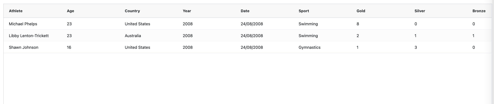

# JS Nation - AG Grid Angular Workshop

## Getting Started with AG Grid

 ```bash
 ng new my-app --style scss --routing false --inline-style --inline-template 

 cd my-app
 npm install --save ag-grid-community ag-grid-angular
 npm run start
 ```

 If everything goes well, `npm run start` has started the web server and conveniently opened a browser
 pointing to [localhost:4200](http://localhost:4200).
 
 ### Add AgGridModule

 Copy the content below into the file `app.modules.ts` to add the `AgGridModule`.

```js
import { NgModule } from '@angular/core';
import { BrowserModule } from '@angular/platform-browser';
import { HttpClientModule } from '@angular/common/http'
import { AgGridModule } from 'ag-grid-angular';
import { AppComponent } from './app.component';

@NgModule({
  declarations: [
    AppComponent
  ],
  imports: [
    BrowserModule,
    AgGridModule
  ],
  providers: [],
  bootstrap: [AppComponent]
})
export class AppModule { }

```

### Setup Component with AG Grid

Setup some row data and matching column definitions. Pass these to the AG Grid component.

```js
import { Component } from '@angular/core';
import { ColDef } from 'ag-grid-community';

@Component({
  selector: 'app-root',
  template: `
    <ag-grid-angular
    style="width: 100%; height: 100%"
    class="ag-theme-alpine"
      [rowData]="rowData"
      [columnDefs]="columnDefs"
    >
    </ag-grid-angular>
  `,
  styles: []
})
export class AppComponent {
  public rowData = [
    { athlete: "Michael Phelps", age: 23, country: "United States", year: 2008, date: "24/08/2008", sport: "Swimming", gold: 8, silver: 0, bronze: 0, total: 8 },
    { athlete: "Libby Lenton-Trickett", age: 23, country: "Australia", year: 2008, date: "24/08/2008", sport: "Swimming", gold: 2, silver: 1, bronze: 1, total: 4 },
    { athlete: "Shawn Johnson", age: 16, country: "United States", year: 2008, date: "24/08/2008", sport: "Gymnastics", gold: 1, silver: 3, bronze: 0, total: 4 }
  ];
  public columnDefs: ColDef[] = [
    { field: 'athlete' },
    { field: 'age' },
    { field: 'country' },
    { field: 'year' },
    { field: 'date' },
    { field: 'sport' },
    { field: 'gold' },
    { field: 'silver' },
    { field: 'bronze' },
    { field: 'total' }
  ];
}

```
### Setup the Styles and Grid Theme

Copy the content below into the file `styles.scss`:

```css
@import 'ag-grid-community/dist/styles/ag-grid.css'; // Core grid CSS, always needed
@import 'ag-grid-community/dist/styles/ag-theme-alpine.css'; // Optional theme CSS

html, body {
    height: 100%;
    width: 100%;
    padding: 5px;
    box-sizing: border-box;
    -webkit-overflow-scrolling: touch;
}
```

 If everything is correct, you should see a simple grid that looks like this:<br/><br/>
 


